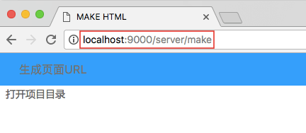
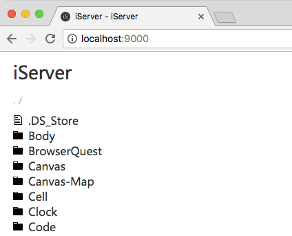
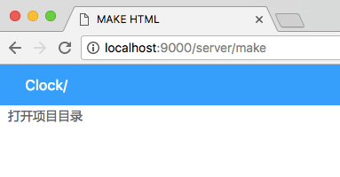

# 生成页面功能

当我们用模板做好页面,一切大功告成时,我们总不能把我们的开发文件发给我们的后台开发人员,因为他们一是完全看不懂,二是也完全用不了,怎么办?

此时我们需要生成文件.目前这个功能处理测试,所以接口页面要自己输入.

#### 1. 在我们的浏览器输入以下地址

(在此之前,我们假定你启动了服务,并将端口和我设定的一样,也是9000,关于怎么启动服务,你可以 [查看此文件](tool.md))

#### 2. 在生成页面url 中输入项目地址

什么是项目地址呢? 其实就是你在浏览器中访问的项目地址比如

在图中, body 是一个文件夹,也就是一个项目, cell canvas code 每个文件夹都是一个项目,同时项目中又可以是项目,比如 body 里面有 abc 和 def 文件夹,那又可以是2个项目

简而言之,**服务器目录下的文件夹就是一个项目,生成就是把在些目录下的文件地址复制过去.**

上图就是准备生成 clock 项目,输入完成后,按 enter 键确认就可以生成了

上图就表示生成完成! 此时你去刷新浏览器,就发现有一个 **clock_HTML2**的文件夹了,这就是生成文件

